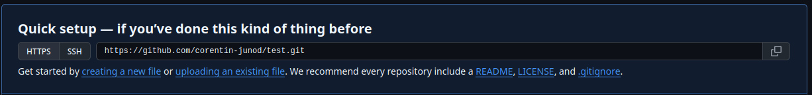

# Mise en place

## Installation

Avant de commencer les exercices, assurez-vous d'avoir installé les logiciels suivants :

- Un éditeur de code, [Visual Studio Code](https://code.visualstudio.com/) est recommandé, mais n'importe quel autre éditeur fera l'affaire
- git, à télécharger ici : https://git-scm.com/
    - Pour vérifier si git est installé, tapez `git -v` dans un terminal, une ligne du type `git version 2.53.0` devrait s'afficher
- NodeJS, à télécharger ici : https://nodejs.org/en
    - Logiciel nécessaire pour gérer des projets fait avec NodeJS et installer facilement des dépendances
- Avoir un compte sur https://github.com/, vous pouvez créer un compte avec votre adresse de l'école si ce n'est pas déjà fait. Il y a possibilité d'avoir des fonctionnalités normalement payantes gratuitement et s'enregistrant avec une adresse étudiante.

## Téléchargement des slides et des exercices

Pour télécharger l'entier du cours : `git clone https://github.com/corentin-junod/HEIGVD-GIO1-2026`  
Le cours sera mis à jour au fur et à mesure du semestre, pour mettre à jour votre dépôt local : `git pull`

---
  

# Exercice 00 - Créer un projet GitHub

Pour prendre en main git et GitHub, commencez par créer un dépôt directement depuis GitHub : 

1. Connectez-vous sur https://github.com/, et cliquez sur le bouton pour créer un nouveau projet : 
2. Donnez-lui un nom selon vos envies, et laissez les autres paramètres par défaut. Cliquez sur "Create Repository"
3. Votre nouveau dépôt vide s'affiche. L'URL indiquée est celle que vous devrez indiquer à git pour cloner le dépôt. 
4. Ouvrez une ligne de commande sur votre ordinateur, et placez-la dans le dossier où vous souhaitez cloner le dépôt.
5. Si vous n'avez jamais utilisé git sur votre machine, il faudra lui indiquer deux paramètres : votre nom et votre adresse mail. Cela est nécessaire car ces informations sont stockées avec chaque commit. Pour cela, tapez les commandes suivantes : 

`git config --global user.name "Prénom Nom"`   
`git config --global user.email adresse@mail.com`   

Cela n'a besoin d'être fait qu'une seule fois.

6. Clonez votre dépôt avec la commande `git clone <url-indiquée-sur-github>`. Et déplacez le terminal dans le dossier nouvellement créé.
7. Ajoutez un fichier à votre projet ! Par exemple, créez un fichier HTML basique nommé index.html.
8. Faites un `git status` pour vérifier l'état de votre projet
9. Quand vous êtes satisfaits de votre fichier, ajoutez le à votre prochain commit avec `git add index.html`
9. Vérifiez que le fichier fera bien parti du prochain commit avec la commande `git status`
10. Créez le commit, avec `git commit -m "Ajout du fichier HTML"`
11. Vous pouvez faire d'autres commits si vous souhaitez. Dès que vous voulez envoyer vos modifications sur GitHub, faites `git push`. Comme vous avez cloné le dépôt depuis GitHub, git sait où il faut push.
12. A ce moment, git devrait ouvrir une page pour vous connecter, et une fois cela fait, votre commit sera envoyé et vous verrez le fichier "index.html" dans votre projet en ligne.